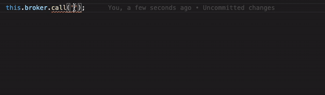

[](https://www.npmjs.com/package/moleculer-ts)
[](https://www.npmjs.com/package/moleculer-ts)
[](https://github.com/jarvify/moleculer-ts/issues)
[](http://moleculer.services/)

# Moleculer TypeScript generator for services types

## Description

`moleculer-ts` is a tool which generates [moleculer](https://github.com/moleculerjs/moleculer) types for your sevices actions & events.

## Features

- Generate types for call, emit, broadcast, broadcastLocal functions
- Customizable Broker & Service interface
- Automatic regeneration of types on files change
- Using ts-patch & ts-transformer-enumerate - please follow installation instructions

## Installation

Follow these steps to install `moleculer-ts`

```bash
# install moleculer and moleculer-ts
npm i moleculer moleculer-ts --save

# install typescript and few other tools
npm i typescript ts-patch ts-transformer-enumerate prettier @types/node -D

# localy patch typescript in order to work properly
node_modules/.bin/ts-patch install
```

### Add to your tsconfig.json

Add `ts-transformer-enumerate` plugin to your `compilerOptions` in your `tsconfig`

```json
{
  "compilerOptions": {
    "plugins": [{ "transform": "ts-transformer-enumerate/transformer" }]
  }
}
```

You should be good to go

### How to generate

#### \*.service.types module structure

Define your service types interface

```typescript
import { Action, Event, ConcatMultiple } from 'moleculer-ts';

// required to specify your service
export const name: 'serviceName' = 'serviceName';

// export list of own service actions
export type OwnActions = [];

// export list of own service events
export type OwnEvents = [];

// concat service's own actions/events with mixins inherited types
export type Actions = ConcatMultiple<[OwnActions]>;
export type Events = ConcatMultiple<[OwnEvents]>;
```

#### Write your gen.broker.types.ts script

Write your generator module. Use `generateBroker` to scan types and prints it in `outputDir`

```typescript
import { generateBroker } from 'moleculer-ts';

(async () => {
  const brokerRootDir = `${process.cwd()}/src`;

  await generateBroker({
    serviceTypesPattern: `${brokerRootDir}/**/*.service.types.ts`,
    outputDir: `${brokerRootDir}/types`,
  });
})();
```

Run this script from `package.json`

```json
{
  "scripts": {
    "gen:broker:types": "ts-node src/gen.broker.types.ts"
  }
}
```

### How to use

import your generated types and use them as input/output definition in service actions

```typescript
import { Context } from 'moleculer';
import { UserServiceTypes } from '{brokerRootDir}/types';

export default {
  name: UserServiceTypes.name,
  actions: {
    async get(
      ctx: Context<UserServiceTypes.ActionParams<'get'>>,
    ): Promise<UserServiceTypes.ActionReturn<'get'>> {
      // fully typed params
      const { params } = ctx;

      // Return matching output
      return {
        id: 'a',
        email: 'a',
        name: 'a',
      };
    },
  },
};
```

### Advanced usage



Want to see more advanced usage? You can enable realtime typescript checking in your IDE

Head to [examples](/examples#readme) to find out more
